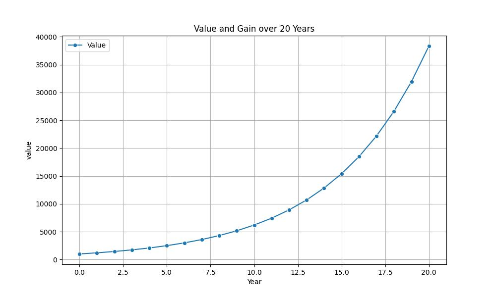

# Financial Black Scholes Options Pricing

A Python project to visualize year-over-year growth of values with a plot. This project uses `polar` and `matplotlib` for data manipulation and plotting.

It has to apps to run each one do the following:

```bash 
uv run black_scholes_model.py 

uv run compounding_interest_calculator.py

```

---

## Features

- Calculates Yearly Gain and YoY Growth
- Plots `Value` over `Year` for easy visualization
- Simple, clean, reusable code

---

## Installation

1. Clone the repository:

```bash
git clone https://github.com/conorzen/blackscholesmodel.git


uv venv
source venv/bin/activate   # On Windows: venv\Scripts\activate

uv sync  # install dependancies
```


## 📝 Code Style Guide

### Python Style

We follow [PEP 8](https://www.python.org/dev/peps/pep-0008/) with some modifications:

- **Line length**: 88 characters (Black default)
- **Docstrings**: Google style docstrings
- **Type hints**: Required for all public functions
- **Imports**: Organized with isort

### Code Formatting

We use automated tools for code formatting:

```bash
# Format code with Black
uv run black {file}

# Sort imports with isort
uv run isort {file}

# Check code style with flake8
uv run flake8 {file}

# Type checking with mypy
 uv run mypy {file}
```

## Author 

 name: conorzen
 email: conoreid@me.com


## Example output


example output for compound_interest_calculator




Thanks.

